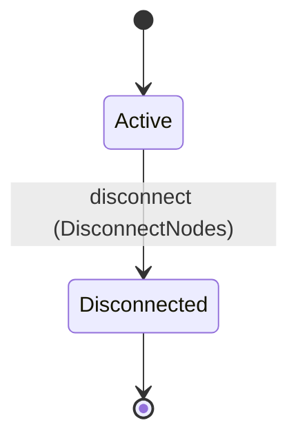
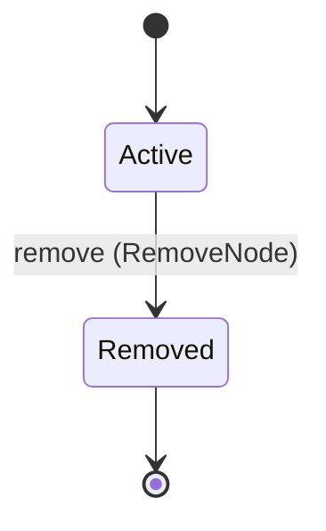
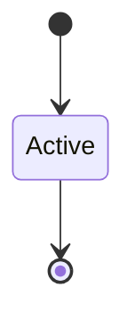
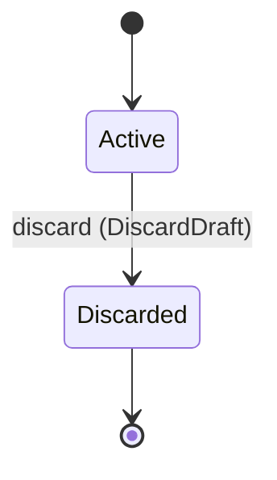
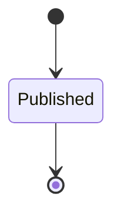

<!--
generated from workflow v1
model digest 6a79078047815754e0dda89f285e08689037af0adfd4277dfcc305f1d003df1b
contract digest 1f20a14314130c4a1d048f7a1f6cb2319a04e70ea589b6d3b51b7e4443f39b95
do not edit: regenerate with `ess generate`
-->

# Workflows

Stable workflows, mutable draft DAGs, canonical published revisions, and activation.

`workflow.definition` is one of workflow's bounded contexts. [Back to the index](../README.md).

## Types

### `CallNode`

`workflow.definition.CallNode` is a record of two fields:

- `connector` — `String`
- `operation` — `String`

### `CompleteNode`

`workflow.definition.CompleteNode` is a record of one field:

- `result` — `String`

### `ComputeNode`

`workflow.definition.ComputeNode` is a record of one field:

- `expression` — `String`

### `DraftId`

`workflow.definition.DraftId` wraps `Uuid` and is not interchangeable with one: the whole value of naming it separately is the crossings the model then refuses.

### `DraftRow`

`workflow.definition.DraftRow` is a record of seven fields:

- `draft_id` — `workflow.definition.DraftId`
- `workflow_id` — `workflow.definition.WorkflowId`
- `name` — `String`
- `based_on_revision_id` — `Optional<workflow.definition.RevisionId>`, which may be absent
- `owner` — `workflow.definition.OwnerRef`
- `scopes` — `workflow.definition.ScopeBindings`
- `state` — `workflow.definition.WorkflowDraft.State`

### `EdgeId`

`workflow.definition.EdgeId` wraps `Uuid` and is not interchangeable with one: the whole value of naming it separately is the crossings the model then refuses.

### `EdgeSnapshot`

`workflow.definition.EdgeSnapshot` is a record of four fields:

- `edge_id` — `workflow.definition.EdgeId`
- `draft_id` — `workflow.definition.DraftId`
- `source_node_id` — `workflow.definition.NodeId`
- `target_node_id` — `workflow.definition.NodeId`

### `EmitNode`

`workflow.definition.EmitNode` is a record of one field:

- `event` — `String`

### `InvokeNode`

`workflow.definition.InvokeNode` is a record of two fields:

- `agent` — `String`
- `instruction` — `String`

### `JudgeNode`

`workflow.definition.JudgeNode` is a record of one field:

- `condition` — `String`

### `NodeDefinition`

`workflow.definition.NodeDefinition` is one of eight shapes, told apart by a `kind` field — tagged, so a decoder never has to guess which branch it is reading:

- `call` — `workflow.definition.CallNode`
- `complete` — `workflow.definition.CompleteNode`
- `compute` — `workflow.definition.ComputeNode`
- `emit` — `workflow.definition.EmitNode`
- `invoke` — `workflow.definition.InvokeNode`
- `judge` — `workflow.definition.JudgeNode`
- `read` — `workflow.definition.ReadNode`
- `wait` — `workflow.definition.WaitNode`

### `NodeId`

`workflow.definition.NodeId` wraps `Uuid` and is not interchangeable with one: the whole value of naming it separately is the crossings the model then refuses.

### `NodeSnapshot`

`workflow.definition.NodeSnapshot` is a record of three fields:

- `node_id` — `workflow.definition.NodeId`
- `draft_id` — `workflow.definition.DraftId`
- `definition` — `workflow.definition.NodeDefinition`

### `OwnerRef`

`workflow.definition.OwnerRef` wraps `String` and is not interchangeable with one: the whole value of naming it separately is the crossings the model then refuses.

### `PrincipalRef`

`workflow.definition.PrincipalRef` wraps `String` and is not interchangeable with one: the whole value of naming it separately is the crossings the model then refuses.

### `ProjectRef`

`workflow.definition.ProjectRef` wraps `String` and is not interchangeable with one: the whole value of naming it separately is the crossings the model then refuses.

### `ReadNode`

`workflow.definition.ReadNode` is a record of two fields:

- `connector` — `String`
- `operation` — `String`

### `RevisionId`

`workflow.definition.RevisionId` wraps `Uuid` and is not interchangeable with one: the whole value of naming it separately is the crossings the model then refuses.

### `RevisionRow`

`workflow.definition.RevisionRow` is a record of 11 fields:

- `revision_id` — `workflow.definition.RevisionId`
- `workflow_id` — `workflow.definition.WorkflowId`
- `draft_id` — `workflow.definition.DraftId`
- `nodes` — `List<workflow.definition.NodeSnapshot>`
- `edges` — `List<workflow.definition.EdgeSnapshot>`
- `digest` — `String`
- `node_count` — `Integer`
- `edge_count` — `Integer`
- `owner` — `workflow.definition.OwnerRef`
- `scopes` — `workflow.definition.ScopeBindings`
- `state` — `workflow.definition.WorkflowRevision.State`

### `ScopeBindings`

`workflow.definition.ScopeBindings` is a record of three fields:

- `principal` — `Optional<workflow.definition.PrincipalRef>`, which may be absent
- `team` — `Optional<workflow.definition.TeamRef>`, which may be absent
- `project` — `Optional<workflow.definition.ProjectRef>`, which may be absent

### `TeamRef`

`workflow.definition.TeamRef` wraps `String` and is not interchangeable with one: the whole value of naming it separately is the crossings the model then refuses.

### `WaitNode`

`workflow.definition.WaitNode` is a record of one field:

- `duration` — `Duration`

### `WorkflowId`

`workflow.definition.WorkflowId` wraps `Uuid` and is not interchangeable with one: the whole value of naming it separately is the crossings the model then refuses.

### `WorkflowRow`

`workflow.definition.WorkflowRow` is a record of six fields:

- `workflow_id` — `workflow.definition.WorkflowId`
- `name` — `String`
- `owner` — `workflow.definition.OwnerRef`
- `scopes` — `workflow.definition.ScopeBindings`
- `active_revision_id` — `Optional<workflow.definition.RevisionId>`, which may be absent
- `state` — `workflow.definition.Workflow.State`

Three of the types above are reached by nothing else in this system: `workflow.definition.DraftRow`, `workflow.definition.RevisionRow` and `workflow.definition.WorkflowRow`. No entity, view, command, event, error or crossing names them, so it is either vocabulary something outside this specification uses or a leftover — and only a person can tell which.

## Entities

An entity is what this context is about: something with an identity that outlives any one request, a shape, and a lifecycle. The lifecycle is exhaustive — a move that is not drawn below is a move this specification does not permit, and that is the only way it says so. Every move is labelled with the command that takes it, because a move nothing can trigger is refused rather than drawn.

### `DraftEdge`

`workflow.definition.DraftEdge`.

An instance is identified by `edge_id`, a `workflow.definition.EdgeId`. The name is part of the model and not a convention: a view projects the identity under that name, so a projection inventing its own would disagree with the view.

It holds:

- `draft_id` — `workflow.definition.DraftId`
- `source_node_id` — `workflow.definition.NodeId`
- `target_node_id` — `workflow.definition.NodeId`

No invariant is declared, so nothing here constrains an instance at rest.

Its state is a `workflow.definition.DraftEdge.State`, one of `Active` and `Disconnected`. That enum is synthesised from the lifecycle rather than declared beside it, so the states a view's filter compares and the states drawn below cannot disagree.

An instance is created in `Active`. `Disconnected` is terminal, so an instance may rest there forever. That is declared rather than inferred from having no way out: an entity that cannot leave a state is either finished or stuck, and only its author knows which.

Each move is taken by a declared command outcome, and a move nothing takes is refused as `missing_causation` rather than left as a state change nobody can trigger:

- `disconnect` — taken by `workflow.definition.DisconnectNodes` on its `disconnected` outcome

An instance is brought into existence by `workflow.definition.ConnectNodes` on its `connected` outcome.

Illegal transitions are illegal by absence: no rule forbids them, there is simply no arrow, because a rule would be a second place for the same truth to live. A diagram cannot show an absence, so the pairs it does not connect are listed here, derived from the same transitions — anything named below is a move this specification does not permit.

- `Disconnected` may not become `Active`

No view projects it, so nothing outside this context is promised a way to observe one.

### `DraftNode`

`workflow.definition.DraftNode`.

An instance is identified by `node_id`, a `workflow.definition.NodeId`. The name is part of the model and not a convention: a view projects the identity under that name, so a projection inventing its own would disagree with the view.

It holds:

- `draft_id` — `workflow.definition.DraftId`
- `definition` — `workflow.definition.NodeDefinition`

No invariant is declared, so nothing here constrains an instance at rest.

Its state is a `workflow.definition.DraftNode.State`, one of `Active` and `Removed`. That enum is synthesised from the lifecycle rather than declared beside it, so the states a view's filter compares and the states drawn below cannot disagree.

An instance is created in `Active`. `Removed` is terminal, so an instance may rest there forever. That is declared rather than inferred from having no way out: an entity that cannot leave a state is either finished or stuck, and only its author knows which.

Each move is taken by a declared command outcome, and a move nothing takes is refused as `missing_causation` rather than left as a state change nobody can trigger:

- `remove` — taken by `workflow.definition.RemoveNode` on its `removed` outcome

An instance is brought into existence by `workflow.definition.AddNode` on its `added` outcome.

Illegal transitions are illegal by absence: no rule forbids them, there is simply no arrow, because a rule would be a second place for the same truth to live. A diagram cannot show an absence, so the pairs it does not connect are listed here, derived from the same transitions — anything named below is a move this specification does not permit.

- `Removed` may not become `Active`

No view projects it, so nothing outside this context is promised a way to observe one.

### `Workflow`

`workflow.definition.Workflow`.

An instance is identified by `workflow_id`, a `workflow.definition.WorkflowId`. The name is part of the model and not a convention: a view projects the identity under that name, so a projection inventing its own would disagree with the view.

It holds:

- `name` — `String`
- `owner` — `workflow.definition.OwnerRef`
- `scopes` — `workflow.definition.ScopeBindings`
- `active_revision_id` — `Optional<workflow.definition.RevisionId>`, which may be absent

No invariant is declared, so nothing here constrains an instance at rest.

Its state is a `workflow.definition.Workflow.State`, one of `Active`. That enum is synthesised from the lifecycle rather than declared beside it, so the states a view's filter compares and the states drawn below cannot disagree.

An instance is created in `Active`. `Active` is terminal, so an instance may rest there forever. That is declared rather than inferred from having no way out: an entity that cannot leave a state is either finished or stuck, and only its author knows which.

It declares no moves, so nothing changes its state once it exists.

It has one state, so there is no move to permit or to forbid.

Two views project it: [`WorkflowById`](#workflowbyid) and [`Workflows`](#workflows).

### `WorkflowDraft`

`workflow.definition.WorkflowDraft`.

An instance is identified by `draft_id`, a `workflow.definition.DraftId`. The name is part of the model and not a convention: a view projects the identity under that name, so a projection inventing its own would disagree with the view.

It holds:

- `workflow_id` — `workflow.definition.WorkflowId`
- `name` — `String`
- `based_on_revision_id` — `Optional<workflow.definition.RevisionId>`, which may be absent
- `owner` — `workflow.definition.OwnerRef`
- `scopes` — `workflow.definition.ScopeBindings`

No invariant is declared, so nothing here constrains an instance at rest.

Its state is a `workflow.definition.WorkflowDraft.State`, one of `Active` and `Discarded`. That enum is synthesised from the lifecycle rather than declared beside it, so the states a view's filter compares and the states drawn below cannot disagree.

An instance is created in `Active`. `Discarded` is terminal, so an instance may rest there forever. That is declared rather than inferred from having no way out: an entity that cannot leave a state is either finished or stuck, and only its author knows which.

Each move is taken by a declared command outcome, and a move nothing takes is refused as `missing_causation` rather than left as a state change nobody can trigger:

- `discard` — taken by `workflow.definition.DiscardDraft` on its `discarded` outcome

An instance is brought into existence by `workflow.definition.CreateDraft` on its `created` outcome.

Illegal transitions are illegal by absence: no rule forbids them, there is simply no arrow, because a rule would be a second place for the same truth to live. A diagram cannot show an absence, so the pairs it does not connect are listed here, derived from the same transitions — anything named below is a move this specification does not permit.

- `Discarded` may not become `Active`

Two views project it: [`DraftById`](#draftbyid) and [`Drafts`](#drafts).

### `WorkflowRevision`

`workflow.definition.WorkflowRevision`.

An instance is identified by `revision_id`, a `workflow.definition.RevisionId`. The name is part of the model and not a convention: a view projects the identity under that name, so a projection inventing its own would disagree with the view.

It holds:

- `workflow_id` — `workflow.definition.WorkflowId`
- `draft_id` — `workflow.definition.DraftId`
- `nodes` — `List<workflow.definition.NodeSnapshot>`
- `edges` — `List<workflow.definition.EdgeSnapshot>`
- `digest` — `String`
- `node_count` — `Integer`
- `edge_count` — `Integer`
- `owner` — `workflow.definition.OwnerRef`
- `scopes` — `workflow.definition.ScopeBindings`

No invariant is declared, so nothing here constrains an instance at rest.

Its state is a `workflow.definition.WorkflowRevision.State`, one of `Published`. That enum is synthesised from the lifecycle rather than declared beside it, so the states a view's filter compares and the states drawn below cannot disagree.

An instance is created in `Published`. `Published` is terminal, so an instance may rest there forever. That is declared rather than inferred from having no way out: an entity that cannot leave a state is either finished or stuck, and only its author knows which.

It declares no moves, so nothing changes its state once it exists.

It has one state, so there is no move to permit or to forbid.

Two views project it: [`RevisionById`](#revisionbyid) and [`Revisions`](#revisions).

## Views

A view is what the outside world is promised it can observe. Each one says which instances it contains and how soon it reflects a command that has already returned, because "you can read this" without "how soon" is the promise every flaky suite is built on.

### `DraftById`

`workflow.definition.DraftById`.

It reads [`WorkflowDraft`](#workflowdraft).

It contains every instance of that entity: no filter narrows it, which is a decision somebody made and not a line somebody omitted.

It exposes:

- `draft_id` — `workflow.definition.DraftId`
- `workflow_id` — `workflow.definition.WorkflowId`
- `name` — `String`
- `based_on_revision_id` — `Optional<workflow.definition.RevisionId>`, which may be absent
- `owner` — `workflow.definition.OwnerRef`
- `scopes` — `workflow.definition.ScopeBindings`
- `state` — `workflow.definition.WorkflowDraft.State`

**Read-your-writes**: it is current the moment the command that changed it returns. A caller that has just created an invoice and cannot see it in here has been told a lie about what it did.

A generated scenario asserts it once, immediately after the command: a view promising this and not keeping the promise has to fail the suite rather than be retried until it passes.

### `Drafts`

`workflow.definition.Drafts`.

It reads [`WorkflowDraft`](#workflowdraft).

It contains every instance of that entity: no filter narrows it, which is a decision somebody made and not a line somebody omitted.

It exposes:

- `draft_id` — `workflow.definition.DraftId`
- `workflow_id` — `workflow.definition.WorkflowId`
- `name` — `String`
- `based_on_revision_id` — `Optional<workflow.definition.RevisionId>`, which may be absent
- `owner` — `workflow.definition.OwnerRef`
- `scopes` — `workflow.definition.ScopeBindings`
- `state` — `workflow.definition.WorkflowDraft.State`

**Read-your-writes**: it is current the moment the command that changed it returns. A caller that has just created an invoice and cannot see it in here has been told a lie about what it did.

A generated scenario asserts it once, immediately after the command: a view promising this and not keeping the promise has to fail the suite rather than be retried until it passes.

### `RevisionById`

`workflow.definition.RevisionById`.

It reads [`WorkflowRevision`](#workflowrevision).

It contains every instance of that entity: no filter narrows it, which is a decision somebody made and not a line somebody omitted.

It exposes:

- `revision_id` — `workflow.definition.RevisionId`
- `workflow_id` — `workflow.definition.WorkflowId`
- `draft_id` — `workflow.definition.DraftId`
- `nodes` — `List<workflow.definition.NodeSnapshot>`
- `edges` — `List<workflow.definition.EdgeSnapshot>`
- `digest` — `String`
- `node_count` — `Integer`
- `edge_count` — `Integer`
- `owner` — `workflow.definition.OwnerRef`
- `scopes` — `workflow.definition.ScopeBindings`
- `state` — `workflow.definition.WorkflowRevision.State`

**Read-your-writes**: it is current the moment the command that changed it returns. A caller that has just created an invoice and cannot see it in here has been told a lie about what it did.

A generated scenario asserts it once, immediately after the command: a view promising this and not keeping the promise has to fail the suite rather than be retried until it passes.

### `Revisions`

`workflow.definition.Revisions`.

It reads [`WorkflowRevision`](#workflowrevision).

It contains every instance of that entity: no filter narrows it, which is a decision somebody made and not a line somebody omitted.

It exposes:

- `revision_id` — `workflow.definition.RevisionId`
- `workflow_id` — `workflow.definition.WorkflowId`
- `draft_id` — `workflow.definition.DraftId`
- `nodes` — `List<workflow.definition.NodeSnapshot>`
- `edges` — `List<workflow.definition.EdgeSnapshot>`
- `digest` — `String`
- `node_count` — `Integer`
- `edge_count` — `Integer`
- `owner` — `workflow.definition.OwnerRef`
- `scopes` — `workflow.definition.ScopeBindings`
- `state` — `workflow.definition.WorkflowRevision.State`

**Read-your-writes**: it is current the moment the command that changed it returns. A caller that has just created an invoice and cannot see it in here has been told a lie about what it did.

A generated scenario asserts it once, immediately after the command: a view promising this and not keeping the promise has to fail the suite rather than be retried until it passes.

### `WorkflowById`

`workflow.definition.WorkflowById`.

It reads [`Workflow`](#workflow).

It contains every instance of that entity: no filter narrows it, which is a decision somebody made and not a line somebody omitted.

It exposes:

- `workflow_id` — `workflow.definition.WorkflowId`
- `name` — `String`
- `owner` — `workflow.definition.OwnerRef`
- `scopes` — `workflow.definition.ScopeBindings`
- `active_revision_id` — `Optional<workflow.definition.RevisionId>`, which may be absent
- `state` — `workflow.definition.Workflow.State`

**Read-your-writes**: it is current the moment the command that changed it returns. A caller that has just created an invoice and cannot see it in here has been told a lie about what it did.

A generated scenario asserts it once, immediately after the command: a view promising this and not keeping the promise has to fail the suite rather than be retried until it passes.

### `Workflows`

`workflow.definition.Workflows`.

It reads [`Workflow`](#workflow).

It contains every instance of that entity: no filter narrows it, which is a decision somebody made and not a line somebody omitted.

It exposes:

- `workflow_id` — `workflow.definition.WorkflowId`
- `name` — `String`
- `owner` — `workflow.definition.OwnerRef`
- `scopes` — `workflow.definition.ScopeBindings`
- `active_revision_id` — `Optional<workflow.definition.RevisionId>`, which may be absent
- `state` — `workflow.definition.Workflow.State`

**Read-your-writes**: it is current the moment the command that changed it returns. A caller that has just created an invoice and cannot see it in here has been told a lie about what it did.

A generated scenario asserts it once, immediately after the command: a view promising this and not keeping the promise has to fail the suite rather than be retried until it passes.

## Commands

### `ActivateRevision`

`workflow.definition.ActivateRevision`, shown to a person as "Activate revision" and called `activate-revision` on the wire.

It takes:

- `workflow_id` — `workflow.definition.WorkflowId`
- `revision_id` — `workflow.definition.RevisionId`

It has one outcome.

**`activated`** — The default branch, taken when no other outcome's condition matched. It changes a `workflow.definition.Workflow` without moving it along its lifecycle. The instance is the one named by the input field `workflow_id`. It emits `workflow.definition.RevisionActivated`. A test reaches it by constructing an input that satisfies no other outcome's condition.

### `AddNode`

`workflow.definition.AddNode`, shown to a person as "Add node" and called `add-node` on the wire.

It takes:

- `workflow_id` — `workflow.definition.WorkflowId`
- `draft_id` — `workflow.definition.DraftId`
- `definition` — `workflow.definition.NodeDefinition`

It has one outcome.

**`added`** — The default branch, taken when no other outcome's condition matched. It creates a `workflow.definition.DraftNode`, which starts in `Active`. The new instance's identity is published as `node_id` on `workflow.definition.NodeAdded`. It emits `workflow.definition.NodeAdded`. A test reaches it by constructing an input that satisfies no other outcome's condition.

### `ConnectNodes`

`workflow.definition.ConnectNodes`, shown to a person as "Connect nodes" and called `connect-nodes` on the wire.

It takes:

- `workflow_id` — `workflow.definition.WorkflowId`
- `draft_id` — `workflow.definition.DraftId`
- `source_node_id` — `workflow.definition.NodeId`
- `target_node_id` — `workflow.definition.NodeId`

It has one outcome.

**`connected`** — The default branch, taken when no other outcome's condition matched. It creates a `workflow.definition.DraftEdge`, which starts in `Active`. The new instance's identity is published as `edge_id` on `workflow.definition.NodesConnected`. It emits `workflow.definition.NodesConnected`. A test reaches it by constructing an input that satisfies no other outcome's condition.

### `CreateDraft`

`workflow.definition.CreateDraft`, shown to a person as "Create draft" and called `create-draft` on the wire.

It takes:

- `workflow_id` — `workflow.definition.WorkflowId`
- `name` — `String`
- `based_on_revision_id` — `Optional<workflow.definition.RevisionId>`, which may be absent

It has one outcome.

**`created`** — The default branch, taken when no other outcome's condition matched. It creates a `workflow.definition.WorkflowDraft`, which starts in `Active`. The new instance's identity is published as `draft_id` on `workflow.definition.DraftCreated`. It emits `workflow.definition.DraftCreated`. A test reaches it by constructing an input that satisfies no other outcome's condition.

### `CreateWorkflow`

`workflow.definition.CreateWorkflow`, shown to a person as "Create workflow" and called `create-workflow` on the wire.

It takes:

- `name` — `String`
- `scopes` — `workflow.definition.ScopeBindings`

It has one outcome.

**`created`** — The default branch, taken when no other outcome's condition matched. It creates a `workflow.definition.Workflow`, which starts in `Active`. The new instance's identity is published as `workflow_id` on `workflow.definition.WorkflowCreated`. It emits `workflow.definition.WorkflowCreated`. A test reaches it by constructing an input that satisfies no other outcome's condition.

### `DiscardDraft`

`workflow.definition.DiscardDraft`, shown to a person as "Discard draft" and called `discard-draft` on the wire.

It takes:

- `workflow_id` — `workflow.definition.WorkflowId`
- `draft_id` — `workflow.definition.DraftId`

It has one outcome.

**`discarded`** — The default branch, taken when no other outcome's condition matched. It moves a `workflow.definition.WorkflowDraft` from `Active` to `Discarded`, along the declared move `discard`. The instance is the one named by the input field `draft_id`. It emits `workflow.definition.DraftDiscarded`. A test reaches it by constructing an input that satisfies no other outcome's condition.

### `DisconnectNodes`

`workflow.definition.DisconnectNodes`, shown to a person as "Disconnect nodes" and called `disconnect-nodes` on the wire.

It takes:

- `workflow_id` — `workflow.definition.WorkflowId`
- `draft_id` — `workflow.definition.DraftId`
- `edge_id` — `workflow.definition.EdgeId`

It has one outcome.

**`disconnected`** — The default branch, taken when no other outcome's condition matched. It moves a `workflow.definition.DraftEdge` from `Active` to `Disconnected`, along the declared move `disconnect`. The instance is the one named by the input field `edge_id`. It emits `workflow.definition.NodesDisconnected`. A test reaches it by constructing an input that satisfies no other outcome's condition.

### `PublishDraft`

`workflow.definition.PublishDraft`, shown to a person as "Publish draft" and called `publish-draft` on the wire.

It takes:

- `workflow_id` — `workflow.definition.WorkflowId`
- `draft_id` — `workflow.definition.DraftId`

It has one outcome.

**`published`** — The default branch, taken when no other outcome's condition matched. It creates a `workflow.definition.WorkflowRevision`, which starts in `Published`. The new instance's identity is published as `revision_id` on `workflow.definition.RevisionPublished`. It emits `workflow.definition.RevisionPublished`. A test reaches it by constructing an input that satisfies no other outcome's condition.

### `RemoveNode`

`workflow.definition.RemoveNode`, shown to a person as "Remove node" and called `remove-node` on the wire.

It takes:

- `workflow_id` — `workflow.definition.WorkflowId`
- `draft_id` — `workflow.definition.DraftId`
- `node_id` — `workflow.definition.NodeId`

It has one outcome.

**`removed`** — The default branch, taken when no other outcome's condition matched. It moves a `workflow.definition.DraftNode` from `Active` to `Removed`, along the declared move `remove`. The instance is the one named by the input field `node_id`. It emits `workflow.definition.NodeRemoved`. A test reaches it by constructing an input that satisfies no other outcome's condition.

### `ReplaceNode`

`workflow.definition.ReplaceNode`, shown to a person as "Replace node" and called `replace-node` on the wire.

It takes:

- `workflow_id` — `workflow.definition.WorkflowId`
- `draft_id` — `workflow.definition.DraftId`
- `node_id` — `workflow.definition.NodeId`
- `definition` — `workflow.definition.NodeDefinition`

It has one outcome.

**`replaced`** — The default branch, taken when no other outcome's condition matched. It changes a `workflow.definition.DraftNode` without moving it along its lifecycle. The instance is the one named by the input field `node_id`. It emits `workflow.definition.NodeReplaced`. A test reaches it by constructing an input that satisfies no other outcome's condition.

### `ValidateDraft`

`workflow.definition.ValidateDraft`, shown to a person as "Validate draft" and called `validate-draft` on the wire.

It takes:

- `workflow_id` — `workflow.definition.WorkflowId`
- `draft_id` — `workflow.definition.DraftId`

It has one outcome.

**`validated`** — The default branch, taken when no other outcome's condition matched. It changes a `workflow.definition.WorkflowDraft` without moving it along its lifecycle. The instance is the one named by the input field `draft_id`. It emits `workflow.definition.DraftValidated`. A test reaches it by constructing an input that satisfies no other outcome's condition.

## Events

### `DraftCreated`

`workflow.definition.DraftCreated`.

It carries:

- `draft_id` — `workflow.definition.DraftId`
- `workflow_id` — `workflow.definition.WorkflowId`
- `name` — `String`
- `based_on_revision_id` — `Optional<workflow.definition.RevisionId>`, which may be absent
- `owner` — `workflow.definition.OwnerRef`
- `scopes` — `workflow.definition.ScopeBindings`

Emitted by `workflow.definition.CreateDraft` on its `created` outcome.

Nothing in this system reacts to it.

### `DraftDiscarded`

`workflow.definition.DraftDiscarded`.

It carries:

- `workflow_id` — `workflow.definition.WorkflowId`
- `draft_id` — `workflow.definition.DraftId`

Emitted by `workflow.definition.DiscardDraft` on its `discarded` outcome.

Nothing in this system reacts to it.

### `DraftValidated`

`workflow.definition.DraftValidated`.

It carries:

- `workflow_id` — `workflow.definition.WorkflowId`
- `draft_id` — `workflow.definition.DraftId`

Emitted by `workflow.definition.ValidateDraft` on its `validated` outcome.

Nothing in this system reacts to it.

### `NodeAdded`

`workflow.definition.NodeAdded`.

It carries:

- `node_id` — `workflow.definition.NodeId`
- `workflow_id` — `workflow.definition.WorkflowId`
- `draft_id` — `workflow.definition.DraftId`
- `definition` — `workflow.definition.NodeDefinition`

Emitted by `workflow.definition.AddNode` on its `added` outcome.

Nothing in this system reacts to it.

### `NodeRemoved`

`workflow.definition.NodeRemoved`.

It carries:

- `workflow_id` — `workflow.definition.WorkflowId`
- `draft_id` — `workflow.definition.DraftId`
- `node_id` — `workflow.definition.NodeId`

Emitted by `workflow.definition.RemoveNode` on its `removed` outcome.

Nothing in this system reacts to it.

### `NodeReplaced`

`workflow.definition.NodeReplaced`.

It carries:

- `workflow_id` — `workflow.definition.WorkflowId`
- `draft_id` — `workflow.definition.DraftId`
- `node_id` — `workflow.definition.NodeId`
- `definition` — `workflow.definition.NodeDefinition`

Emitted by `workflow.definition.ReplaceNode` on its `replaced` outcome.

Nothing in this system reacts to it.

### `NodesConnected`

`workflow.definition.NodesConnected`.

It carries:

- `edge_id` — `workflow.definition.EdgeId`
- `workflow_id` — `workflow.definition.WorkflowId`
- `draft_id` — `workflow.definition.DraftId`
- `source_node_id` — `workflow.definition.NodeId`
- `target_node_id` — `workflow.definition.NodeId`

Emitted by `workflow.definition.ConnectNodes` on its `connected` outcome.

Nothing in this system reacts to it.

### `NodesDisconnected`

`workflow.definition.NodesDisconnected`.

It carries:

- `workflow_id` — `workflow.definition.WorkflowId`
- `draft_id` — `workflow.definition.DraftId`
- `edge_id` — `workflow.definition.EdgeId`

Emitted by `workflow.definition.DisconnectNodes` on its `disconnected` outcome.

Nothing in this system reacts to it.

### `RevisionActivated`

`workflow.definition.RevisionActivated`.

It carries:

- `workflow_id` — `workflow.definition.WorkflowId`
- `active_revision_id` — `workflow.definition.RevisionId`

Emitted by `workflow.definition.ActivateRevision` on its `activated` outcome.

Nothing in this system reacts to it.

### `RevisionPublished`

`workflow.definition.RevisionPublished`.

It carries:

- `revision_id` — `workflow.definition.RevisionId`
- `workflow_id` — `workflow.definition.WorkflowId`
- `draft_id` — `workflow.definition.DraftId`
- `nodes` — `List<workflow.definition.NodeSnapshot>`
- `edges` — `List<workflow.definition.EdgeSnapshot>`
- `digest` — `String`
- `node_count` — `Integer`
- `edge_count` — `Integer`
- `owner` — `workflow.definition.OwnerRef`
- `scopes` — `workflow.definition.ScopeBindings`

Emitted by `workflow.definition.PublishDraft` on its `published` outcome.

Nothing in this system reacts to it.

### `WorkflowCreated`

`workflow.definition.WorkflowCreated`.

It carries:

- `workflow_id` — `workflow.definition.WorkflowId`
- `name` — `String`
- `owner` — `workflow.definition.OwnerRef`
- `scopes` — `workflow.definition.ScopeBindings`

Emitted by `workflow.definition.CreateWorkflow` on its `created` outcome.

Nothing in this system reacts to it.

## Actors

An actor is who may ask this context for something. Every grant below points at a command this specification declares — a grant is a resolved reference, so "may invoke" something nobody wrote is not a permission this model can express, and an authorisation that authorises nothing cannot ship quietly.

### `Author`

`workflow.definition.Author`, shown to a person as "Workflow author".

It may invoke [`ActivateRevision`](#activaterevision), [`AddNode`](#addnode), [`ConnectNodes`](#connectnodes), [`CreateDraft`](#createdraft), [`CreateWorkflow`](#createworkflow), [`DiscardDraft`](#discarddraft), [`DisconnectNodes`](#disconnectnodes), [`PublishDraft`](#publishdraft), [`RemoveNode`](#removenode), [`ReplaceNode`](#replacenode) and [`ValidateDraft`](#validatedraft).

---

Generated from workflow v1 · model digest `6a79078047815754e0dda89f285e08689037af0adfd4277dfcc305f1d003df1b` · contract digest `1f20a14314130c4a1d048f7a1f6cb2319a04e70ea589b6d3b51b7e4443f39b95`. Do not edit this file; change the specification and regenerate it with `ess generate`.
