<!--
generated from workflow v1
model digest 6a79078047815754e0dda89f285e08689037af0adfd4277dfcc305f1d003df1b
contract digest 1f20a14314130c4a1d048f7a1f6cb2319a04e70ea589b6d3b51b7e4443f39b95
do not edit: regenerate with `ess generate`
-->

# workflow v1

Tenant-partitioned workflow definitions with mutable draft graphs, canonical immutable revisions, and explicit activation.

## The system as a graph

```mermaid
flowchart TB
    subgraph who["who may ask"]
        who0["workflow.definition.Author"]
    end
    subgraph unit0["workflow-service"]
        cmd0["workflow.definition.ActivateRevision"]
        cmd1["workflow.definition.AddNode"]
        cmd2["workflow.definition.ConnectNodes"]
        cmd3["workflow.definition.CreateDraft"]
        cmd4["workflow.definition.CreateWorkflow"]
        cmd5["workflow.definition.DiscardDraft"]
        cmd6["workflow.definition.DisconnectNodes"]
        cmd7["workflow.definition.PublishDraft"]
        cmd8["workflow.definition.RemoveNode"]
        cmd9["workflow.definition.ReplaceNode"]
        cmd10["workflow.definition.ValidateDraft"]
        evt0["workflow.definition.DraftCreated"]
        evt1["workflow.definition.DraftDiscarded"]
        evt2["workflow.definition.DraftValidated"]
        evt3["workflow.definition.NodeAdded"]
        evt4["workflow.definition.NodeRemoved"]
        evt5["workflow.definition.NodeReplaced"]
        evt6["workflow.definition.NodesConnected"]
        evt7["workflow.definition.NodesDisconnected"]
        evt8["workflow.definition.RevisionActivated"]
        evt9["workflow.definition.RevisionPublished"]
        evt10["workflow.definition.WorkflowCreated"]
    end
    who0 -->|"may invoke"| cmd0
    who0 -->|"may invoke"| cmd1
    who0 -->|"may invoke"| cmd2
    who0 -->|"may invoke"| cmd3
    who0 -->|"may invoke"| cmd4
    who0 -->|"may invoke"| cmd5
    who0 -->|"may invoke"| cmd6
    who0 -->|"may invoke"| cmd7
    who0 -->|"may invoke"| cmd8
    who0 -->|"may invoke"| cmd9
    who0 -->|"may invoke"| cmd10
    cmd0 -->|"activated"| evt8
    cmd1 -->|"added"| evt3
    cmd2 -->|"connected"| evt6
    cmd3 -->|"created"| evt0
    cmd4 -->|"created"| evt10
    cmd5 -->|"discarded"| evt1
    cmd6 -->|"disconnected"| evt7
    cmd7 -->|"published"| evt9
    cmd8 -->|"removed"| evt4
    cmd9 -->|"replaced"| evt5
    cmd10 -->|"validated"| evt2
```

A command is accepted by the component that owns its context, emits the events one of its outcomes declares, and a dashed edge is a binding carrying an event into the next command. Design §9 begins one step earlier, at the actor who invokes the first command, and so does this graph: a solid edge out of an actor is a grant, and an actor drawn with no edge at all may invoke nothing — which is something the model says, not an arrow somebody forgot.

## Bounded contexts

- **[Workflows](domains/workflow-definition.md)** (`workflow.definition`) — Stable workflows, mutable draft DAGs, canonical published revisions, and activation. 24 types, five entities, six views, 11 commands, 11 events, no errors and one actor.

## Components

A component is a unit of ownership, not a deployment. How many of each runs, and what each needs, is [the topology](topology.md).

**`workflow-service`** — Owns workflow definitions, draft graphs, immutable revisions, and activation. It owns [`workflow.definition`](domains/workflow-definition.md). It accepts `workflow.definition.ActivateRevision`, `workflow.definition.AddNode`, `workflow.definition.ConnectNodes`, `workflow.definition.CreateDraft`, `workflow.definition.CreateWorkflow`, `workflow.definition.DiscardDraft`, `workflow.definition.DisconnectNodes`, `workflow.definition.PublishDraft`, `workflow.definition.RemoveNode`, `workflow.definition.ReplaceNode` and `workflow.definition.ValidateDraft`. It publishes `workflow.definition.DraftCreated`, `workflow.definition.DraftDiscarded`, `workflow.definition.DraftValidated`, `workflow.definition.NodeAdded`, `workflow.definition.NodeRemoved`, `workflow.definition.NodeReplaced`, `workflow.definition.NodesConnected`, `workflow.definition.NodesDisconnected`, `workflow.definition.RevisionActivated`, `workflow.definition.RevisionPublished` and `workflow.definition.WorkflowCreated`.

## The other pages

| page | what is on it |
|---|---|
| [Workflows](domains/workflow-definition.md) | the `workflow.definition` vocabulary: its types, entities, views, commands, events, errors and actors |
| [Interactions](interactions.md) | every binding, with what it guarantees and what happens when it fails |
| [Type crossings](crossings.md) | every conversion this system permits, and the reason someone gave for it |
| [Topology](topology.md) | what each component needs in order to run |

---

Generated from workflow v1 · model digest `6a79078047815754e0dda89f285e08689037af0adfd4277dfcc305f1d003df1b` · contract digest `1f20a14314130c4a1d048f7a1f6cb2319a04e70ea589b6d3b51b7e4443f39b95`. Do not edit this file; change the specification and regenerate it with `ess generate`.
